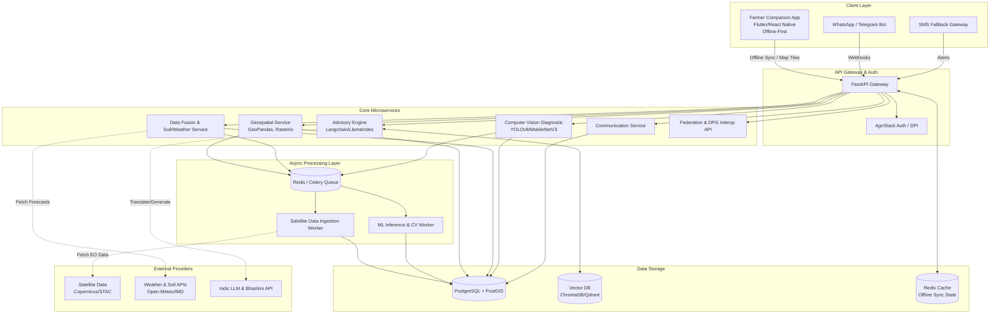

# Interoperable Digital Agriculture Network (DPG)
## Implementation Plan & Architecture Blueprint

This blueprint outlines the design, data architecture, phased roadmap, and project structure for the open-source, federated Digital Public Good (DPG) agricultural system.

---

### 1. End-to-End System Architecture Diagram

The system employs a microservices architecture centered around FastAPI, with a robust async processing layer for heavy data ingestion (satellite imagery) and machine learning inference. It supports a dual-channel client strategy: a low-bandwidth WhatsApp/Telegram interface and a rich offline-first Native Mobile App.



---

### 2. Database & Entity Schema (PostgreSQL + PostGIS)

The core relational database leverages PostGIS for spatial indexing, crucial for plotting farm boundaries and intersecting them with raster data and weather models.

* **`Farmers`**
  * `id` (UUID, Primary Key)
  * `agristack_id` (String, Unique) - For DPI integration
  * `name` (String)
  * `phone_number` (String, Unique)
  * `language_preference` (Enum: Hindi, Marathi, Telugu, English, etc.)
  * `created_at` (Timestamp)

* **`Plots`**
  * `id` (UUID, Primary Key)
  * `farmer_id` (UUID, Foreign Key)
  * `geom` (Geometry/Polygon, EPSG:4326) - Cadastral coordinates
  * `area_hectares` (Float)
  * `crop_type` (String)
  * `created_at` (Timestamp)

* **`SatellitePasses`**
  * `id` (UUID, Primary Key)
  * `plot_id` (UUID, Foreign Key)
  * `pass_date` (Timestamp)
  * `ndvi` (Float) - Crop vigor
  * `ndwi` (Float) - Canopy water stress
  * `ndre` (Float) - Chlorophyll/Nitrogen health
  * `source` (Enum: Sentinel-2, Landsat-8)
  * `raster_tile_url` (String) - Reference for rendering on Mobile App

* **`SoilProfiles`**
  * `id` (UUID, Primary Key)
  * `plot_id` (UUID, Foreign Key)
  * `sample_date` (Date)
  * `ph` (Float)
  * `nitrogen` (Float)
  * `phosphorus` (Float)
  * `potassium` (Float)
  * `organic_carbon` (Float)
  * `electrical_conductivity` (Float)

* **`WeatherLogs`**
  * `id` (UUID, Primary Key)
  * `plot_id` (UUID, Foreign Key)
  * `date` (Date)
  * `max_temp` (Float)
  * `min_temp` (Float)
  * `precipitation` (Float)
  * `humidity` (Float)
  * `wind_speed` (Float)

* **`Alerts`**
  * `id` (UUID, Primary Key)
  * `farmer_id` (UUID, Foreign Key)
  * `plot_id` (UUID, Foreign Key, Nullable)
  * `alert_type` (Enum: Disease, Weather, Irrigation, Advisory)
  * `message` (Text)
  * `sent_via` (Enum: WhatsApp, AppPush, SMS)
  * `status` (Enum: Pending, Sent, Read, Failed)
  * `created_at` (Timestamp)

* **`DiseaseScans`**
  * `id` (UUID, Primary Key)
  * `farmer_id` (UUID, Foreign Key)
  * `plot_id` (UUID, Foreign Key, Nullable)
  * `image_url` (String) - Cloud storage reference
  * `detection_result` (String)
  * `confidence_score` (Float)
  * `pathogen_type` (String)
  * `recommended_action` (Text)
  * `scanned_at` (Timestamp)
  * `synced` (Boolean) - For tracking offline-first mobile app sync status

---

### 3. Phased Implementation Roadmap

**Phase 1: Core DB, Geo-Ingestion, & Mobile App Foundation**
* **Backend:** Setup PostgreSQL + PostGIS. Define Alembic migrations for core schemas (`Farmers`, `Plots`). Develop FastAPI user management and authentication foundation. 
* **Geospatial Pipeline:** Build mock background workers for satellite data ingestion to test database inserts.
* **Frontend (Native App):** Initialize Flutter/React Native app. Setup local DB (SQLite/Hive) for offline-first architecture. Integrate Mapbox/MapLibre SDK to draw plot boundaries and sync GeoJSON polygons with the backend.

**Phase 2: Live Sentinel-2 STAC Pipeline & Soil/Weather Fusion Logic**
* **Backend:** Connect Celery workers to Copernicus/STAC APIs for fetching Sentinel-2 imagery. Process imagery to calculate NDVI, NDWI, and NDRE. 
* **Backend:** Integrate Open-Meteo/IMD APIs. Develop the Data Fusion Engine to synthesize weather, soil parameters, and satellite indices to trigger rudimentary alerts.
* **Frontend (Native App):** Implement map overlays allowing farmers to view generated satellite heatmaps (raster map tiles) over their digitized plots.

**Phase 3: Crop Disease Diagnostic Model Pipeline**
* **AI/ML:** Prepare and fine-tune YOLOv8 or MobileNetV3 models on crop disease datasets (e.g., PlantVillage). Deploy model as a FastAPI inference service.
* **Frontend (Native App):** Build the disease scanner interface. Implement an offline queuing mechanism where photos taken in low-connectivity areas are saved locally and synced for background inference once connectivity is restored.

**Phase 4: Advisory Engine (RAG) + Vernacular Bot Integration**
* **AI/ML:** Ingest agronomic advisory manuals (ICAR guides) into ChromaDB/Qdrant. Create the LangChain/LlamaIndex RAG pipeline to generate regenerative advisory responses.
* **Backend:** Integrate Bhashini API or IndicTrans2 for real-time translation of advisories.
* **Frontend (Bot):** Build WhatsApp/Telegram webhook interfaces (Subsystem E) for proactive push notifications and reactive disease diagnosis chatbots.
* **Frontend (Native App):** Develop the Geotagged Directory utilizing GPS to locate and list nearby bio-input dealers, KVKs, and soil labs.

**Phase 5: DPG Interoperability APIs & State Federation Endpoints**
* **Backend:** Expose RESTful/gRPC Federated Registry APIs adhering to OpenAPI 3.1 and DPGA standards. 
* **Auth:** Finalize AgriStack DPI integration, enabling "Farmer ID" OAuth/OTP login across the Mobile App and Bot ecosystems.
* **DevOps:** Containerize all services with Docker. Provide Kubernetes manifests for scalable, cloud-agnostic deployment.

---

### 4. Project Directory Structure

```text
agro_dpg/
├── backend/                  # FastAPI & Microservices
│   ├── app/
│   │   ├── api/
│   │   │   ├── routes/       # Endpoints (geo, cv, rag, federated)
│   │   │   └── dependencies.py
│   │   ├── core/             # Configs, Security, DB connect
│   │   ├── models/           # SQLAlchemy & PostGIS models
│   │   ├── schemas/          # Pydantic schemas (JSON/OpenAPI specs)
│   │   ├── services/         # Business logic (Geospatial, CV, Data Fusion)
│   │   ├── workers/          # Celery/ARQ task definitions
│   │   └── main.py           # Application entrypoint
│   ├── alembic/              # Database migrations
│   ├── tests/
│   ├── requirements.txt
│   ├── Dockerfile
│   └── docker-compose.yml    # Local dev setup (DB, Redis, FastAPI, Workers)
├── mobile_app/               # Flutter / React Native Native Application
│   ├── src/                  # (or lib/ for Flutter)
│   │   ├── db/               # Local offline SQLite/Hive models and sync logic
│   │   ├── screens/          # UI: MapView, Scanner, GeoDirectory, Dashboard
│   │   ├── services/         # API clients and background sync managers
│   │   └── utils/            # Geolocation, Auth handlers
│   └── package.json          # (or pubspec.yaml)
├── ai_models/                # Model Training & RAG ingestion
│   ├── cv_disease/           # Training scripts, YOLOv8 weights, datasets
│   └── rag_advisory/         # Knowledge base prep, chunking logic, Vector DB setup
└── docs/                     # Comprehensive Architecture & API Documentation
    └── openapi_specs/
```
